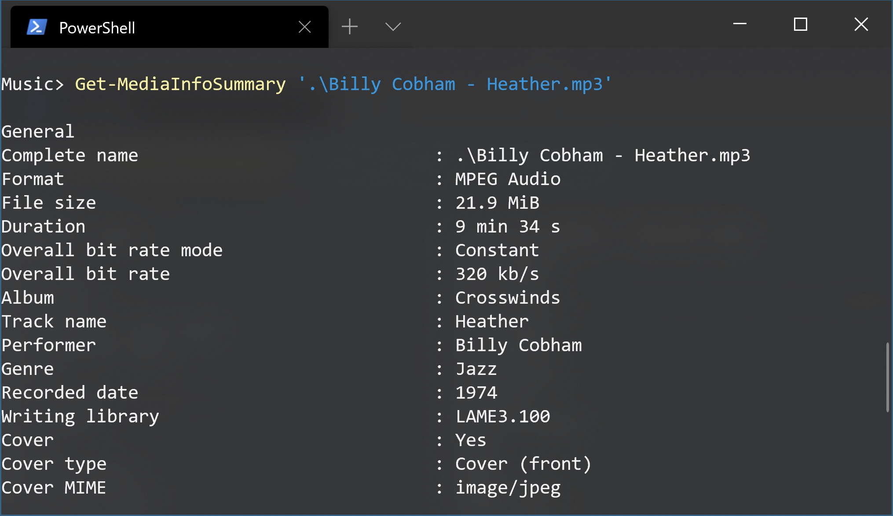
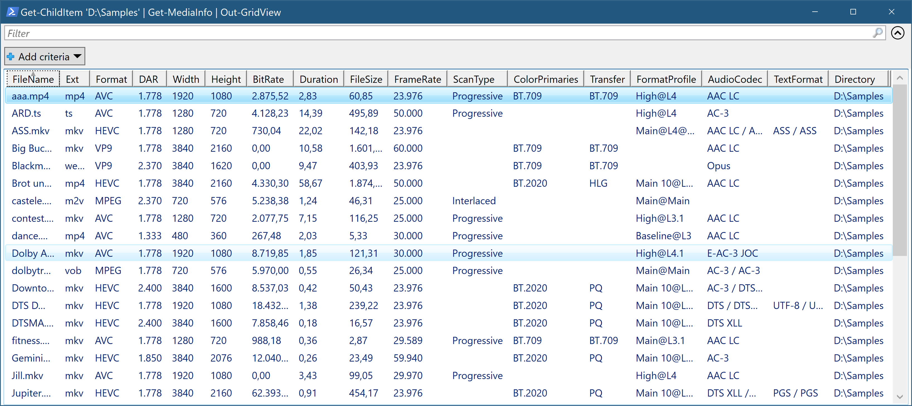

Get-MediaInfo (Hrxn's fork)
===========================

Get-MediaInfo is a PowerShell MediaInfo solution.

It consists of four functions:

- [Get-MediaInfo](#get-mediainfo)
- [Get-MediaInfoValue](#get-mediainfovalue)
- [Get-MediaInfoSummary](#get-mediainfosummary)
- [Clear-MediaInfoCache](#clear-mediainfocache)






Installation
------------

1. Simply clone this repository or download the source archive file of this repository
2. Place the files into one of PowerShell's automatic module paths (or import it manually, or via your `$PROFILE` file)
    - Example: `~\Documents\PowerShell\Modules\Get-MediaInfo\3.8.0`

###### Please Note
**The documentation beyond this point still reflects the state of the original project and has not been completely ~~updated~~ yet.**  
**Usage should be pretty self-explanatory anyway.**

Get-MediaInfo
=============

Converts media file objects into MediaInfo objects.

```
NAME
    Get-MediaInfo

SYNTAX
    Get-MediaInfo [[-Path] <string[]>] [-Video] [-Audio]  [<CommonParameters>]

ALIASES
    gmi
```


Description
-----------

Converts media file objects into MediaInfo objects.


Examples
--------

Displays media files of the defined folder using a grid view.

```PowerShell
Get-ChildItem 'D:\Samples' | Get-MediaInfo | Out-GridView
```


Same as above but using the current folder and aliases.

```PowerShell
gci | gmi | ogv
```


Find duplicates by comparing the duration.

```PowerShell
gci | gmi | select filename, duration, filesize | group duration | where { $_.count -gt 1 } | select -expand group | format-list
```


Parameters
----------

**-Path**

String array with audio or video files or FileInfo objects via pipeline.


**-Video**

Only video files will be processed.


**-Audio**

Only audio files will be processed.


Input
-----

String array with audio or video files as Path parameter or FileInfo objects via pipeline.


Output
------

MediaInfo objects.


Get-MediaInfoValue
==================

Returns specific properties from media files.

```
NAME
    Get-MediaInfoValue

SYNTAX
    Get-MediaInfoValue
        [-Path] <string>
        [-Kind] {General | Video | Audio | Text | Image | Menu}
        [[-Index] <int>]
        [-Parameter] <string>
        [<CommonParameters>]

ALIASES
    gmiv
```

Description
-----------

Returns specific properties from media files.


Examples
--------

Get the artist from a MP3 file.

```PowerShell
Get-MediaInfoValue '.\Meg Myers - Desire (Hucci Remix).mp3' -Kind General -Parameter Performer

Meg Myers
```


Get the channel count in a MP3 file. Return types are always strings and if necessary must be cast to integer.

```PowerShell
'.\Meg Myers - Desire (Hucci Remix).mp3' | Get-MediaInfoValue -Kind Audio -Parameter 'Channel(s)'

2
```


Get the language of the second audio stream in a movie.

The Index parameter is zero based.

```PowerShell
Get-MediaInfoValue '.\The Warriors.mkv' -Kind Audio -Index 1 -Parameter 'Language/String'

English
```


Get the count of subtitle streams in a movie.

```PowerShell
Get-MediaInfoValue '.\The Warriors.mkv' -Kind General -Parameter 'TextCount'

2
```


Parameters
----------

**-Path**

Path to a media file.


**-Kind** General | Video | Audio | Text | Image | Menu

A MediaInfo kind.

Kinds and their properties can be seen with [MediaInfo.NET](https://github.com/stax76/MediaInfo.NET).


**-Index**

Zero based stream number.


**-Parameter**

Name of the property to get.

The property names can be seen with [MediaInfo.NET](https://github.com/stax76/MediaInfo.NET) with following setting enabled:

Show parameter names as they are used in the MediaInfo API

They can also be seen with Get-MediaInfoSummary with the -Raw flag enabled.


Input
-----

Input can be defined with the Path parameter, pipe input supports a path as string or a FileInfo object.


Output
------

Output will always be of type string and must be cast to other types like integer if necessary.


Using the .NET class directly for highest performance
-----------------------------------------------------

To retrieve specific properties with highest possible performance the .NET class must be used directly:

```
$mi = New-Object MediaInfo -ArgumentList $Path
$value1 = $mi.GetInfo($Kind, $Index, $Parameter)
$value2 = $mi.GetInfo($Kind, $Index, $Parameter)
$mi.Dispose()
```

Get-MediaInfoSummary
====================

Shows a summary in text format for a media file.

```
NAME
    Get-MediaInfoSummary

SYNTAX
    Get-MediaInfoSummary [-Path] <string> [-Full] [-Raw]  [<CommonParameters>]

ALIASES
    gmis
```

Description
-----------

Shows a summary in text format for a media file.

Examples
--------

```PowerShell
 Get-MediaInfoSummary 'D:\Samples\Downton Abbey.mkv'
```

Parameters
----------

**-Path**

Path to a media file. Can also be passed via pipeline.


**-Full**

Show a extended summary.


**-Raw**

Show not the friendly parameter names but rather the names as they are used in the MediaInfo API.

Parameter names passed to Get-MediaInfoValue -Parameter must use the raw parameter name.


Input
-----

Path as string to a media file. Can also be passed via pipeline.


Output
------

A summary line by line as string array.


Clear-MediaInfoCache
====================

Description
-----------
Deletes the locally cached results created by `Get-MediaInfo $MyInput -WriteCache`.

Input
-----

None.

Output
------

None.
